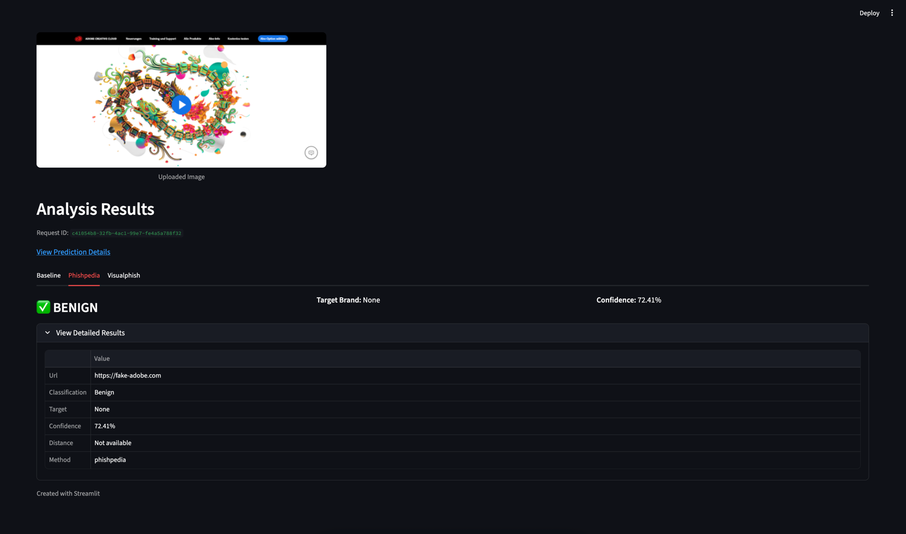

# Phishing Target Recognition



> [!NOTE]
> **TLDR**
> This project is a system designed to compare various phishing detection methods on visual data. It was developed as
> part of a bachelor's thesis at the Warsaw University of Technology. The implemented methods are:
> - [Phishpedia](https://github.com/lindsey98/Phishpedia) - a CNN model for phishing detection based on logos
> - [VisualPhish](https://github.com/S-Abdelnabi/VisualPhishNet) - a deep learning model for phishing detection based on
    visual features
> - Baseline: perceptual hashing and similarity search, custom implementation
>
> A summary of all evaluation runs can be found in [EVALUATION_RESULTS.md](EVALUATION_RESULTS.md).

## Table of Contents

<!-- TOC -->
* [Phishing Target Recognition](#phishing-target-recognition)
  * [Table of Contents](#table-of-contents)
  * [Technologies Used](#technologies-used)
  * [Prerequisites](#prerequisites)
  * [Quickstart](#quickstart)
    * [1) Prepare your CSV (if using your own dataset)](#1-prepare-your-csv-if-using-your-own-dataset)
    * [2) Configure the data splitter (config.json)](#2-configure-the-data-splitter-configjson)
    * [3) Split and organize](#3-split-and-organize)
    * [4) Run models on the created splits](#4-run-models-on-the-created-splits)
      * [Phishpedia (evaluate on test set)](#phishpedia-evaluate-on-test-set)
      * [VisualPhish](#visualphish)
        * [Optimize threshold (VisualPhish)](#optimize-threshold-visualphish)
      * [Baseline](#baseline)
        * [Optimize threshold (Baseline)](#optimize-threshold-baseline)
    * [Web Interface Demo](#web-interface-demo)
    * [Docker volumes and mounted files](#docker-volumes-and-mounted-files)
    * [Notes](#notes)
    * [Useful scripts](#useful-scripts)
  * [Unit Tests](#unit-tests)
<!-- TOC -->

## Technologies Used

This project is built with a modern Python stack, leveraging the following key technologies:

- **Programming Language**:
    - Python 3.9

- **Machine Learning & Data Processing**:
    - PyTorch
    - scikit-learn
    - NumPy & Pandas
    - Pillow (PIL)
    - FAISS

- **API & Web Interface**:
    - FastAPI
    - Streamlit
    - Docker

- **Development & Tooling**:
    - uv
    - just
    - WandB

## Prerequisites

Before starting, install these tools:

- **Just**: A command runner. Installation instructions can be
  found [here](https://github.com/casey/just?tab=readme-ov-file#packages).
- **uv**: An advanced Python package and environment manager. Install using the following commands:
  ```bash
  curl -LsSf https://astral.sh/uv/0.5.18/install.sh | sh
  source $HOME/.local/bin/env
  ```
- **unzip**: A tool for decompressing ZIP files.

**Initial setup (required for all paths):**

1. Install development tools:
   ```bash
   just tools
   ```
2. Set the `PROJECT_ROOT_DIR` environment variable to point to the main project directory:
   ```bash
   export PROJECT_ROOT_DIR=$(pwd)
   ```
   You can also add this command to your shell configuration file (e.g., `~/.zshrc` or `~/.bashrc`) to make it available
   in every new terminal session:
   ```bash
   echo "export PROJECT_ROOT_DIR=$(pwd)" >> ~/.zshrc # For Zsh
   # or
   echo "export PROJECT_ROOT_DIR=$(pwd)" >> ~/.bashrc # For Bash
   source ~/.zshrc # or source ~/.bashrc
   ```

## Quickstart

This project uses the `src/data_splitter` tool to create 60:20:20 train/val/test splits and automatically organize the
data
for Phishpedia and VisualPhish.

### 1) Prepare your CSV (if using your own dataset)

The CSV must include:

```shell
"url",
"fqdn",
"screenshot_object",
"affected_entity",
"is_phishing"
```

### 2) Configure the data splitter (config.json)

Add a `data_split` section. Choose a `label_strategy` that matches your dataset layout (`subfolders`, `labels_file`, or
`directory`).

```json
{
  "data_split": {
    "random_state": 42,
    "output_directory": "data_splits",
    "create_symlinks": true,
    "datasets": {
      "my_dataset": {
        "path": "data/interim/my_dataset",
        "label_strategy": "directory",
        "target_mapping": {
          "phishing": "phishing",
          "benign": "trusted_list"
        }
      }
    }
  }
}
```

Reference for label strategies:

- `subfolders`: Each sample has its own folder containing `shot.png` and `info.txt`.
- `labels_file`: A flat directory of images with a `labels.txt` file.
- `directory`: Images grouped by target as subdirectories, e.g., the VisualPhish dataset.

### 3) Split and organize

```bash
just setup-data-splitter
uv run src/data_splitter/split_data.py config.json
```

Outputs under `$PROJECT_ROOT_DIR/data_splits/my_dataset`:

- `train.csv`, `val.csv`, `test.csv`
- `visualphish/data/{train,val,test}/{trusted_list,phishing}/...`
- `phishpedia/data/{train,val,test}/{trusted_list,phishing}/...` with `shot.png`/`info.txt`

### 4) Run models on the created splits

#### Phishpedia (evaluate on test set)

Set up (via `just`; uses `src/models/phishpedia/justfile`):

```bash
# Install dependencies and download models
just run-pp setup

# Or only download models (if dependencies are already installed)
just run-pp setup-models
```

```bash
mkdir -p $PROJECT_ROOT_DIR/logs/phishpedia
uv run src/models/phishpedia/phishpedia.py \
  --folder $PROJECT_ROOT_DIR/data_splits/my_dataset/phishpedia/data/test/phishing \
  --output_txt $PROJECT_ROOT_DIR/logs/phishpedia/test_results.txt \
  --log
```

#### VisualPhish

Set up once:

```bash
# Or run `just run-vp setup`
cd src/models/visualphishnet
uv sync
uv run wandb login YOUR_API_KEY
```

Train (uses `trusted_list` and `phishing` under `.../visualphish/data/train`):

```bash
uv run src/models/visualphishnet/trainer.py \
  --dataset-path $PROJECT_ROOT_DIR/data_splits/my_dataset/visualphish/data/train \
  --logdir $PROJECT_ROOT_DIR/logs/visualphish/my_dataset \
  --output-dir $PROJECT_ROOT_DIR/data/processed/VisualPhish/my_dataset
```

Evaluate on test set:

```bash
uv run src/models/visualphishnet/eval_new.py \
  --emb-dir $PROJECT_ROOT_DIR/data/processed/VisualPhish/my_dataset \
  --data-dir $PROJECT_ROOT_DIR/data_splits/my_dataset/visualphish/data/test \
  --phish-folder phishing \
  --benign-folder trusted_list \
  --threshold 8.0 \
  --result-path $PROJECT_ROOT_DIR/logs/visualphish/my_dataset \
  --save-folder $PROJECT_ROOT_DIR/logs/visualphish/my_dataset_results
```

Note (macOS TMP space):

```bash
export TMPDIR=$HOME/tmp
```

##### Optimize threshold (VisualPhish)

Use the EER-based optimizer to tune the decision threshold using validation splits created by the splitter.

```bash
uv run src/models/visualphishnet/threshold_optimizer.py \
  --emb-dir $PROJECT_ROOT_DIR/data/processed/VisualPhish/my_dataset \
  --val-phish-dir $PROJECT_ROOT_DIR/data_splits/my_dataset/visualphish/data/val/phishing \
  --val-benign-dir $PROJECT_ROOT_DIR/data_splits/my_dataset/visualphish/data/val/trusted_list \
  --mean 8 --std 22 --max 100 \
  --output-dir $PROJECT_ROOT_DIR/logs/visualphish/threshold_opt \
  --plot
```

Outputs:

- `$PROJECT_ROOT_DIR/logs/visualphish/threshold_opt/optimal_threshold.json`
- `$PROJECT_ROOT_DIR/logs/visualphish/threshold_opt/threshold_sweep.csv`
  Use the reported threshold with `eval_new.py` via `--threshold`.

#### Baseline

Set up the environment:

```bash
cd src/models/baseline
uv sync
```

Build the FAISS index from the training data (phishing, then benign):

```bash
mkdir -p $PROJECT_ROOT_DIR/logs/baseline
cd $PROJECT_ROOT_DIR/src/models/baseline

uv run load.py \
  --images $PROJECT_ROOT_DIR/data_splits/my_dataset/visualphish/data/train/phishing \
  --index $PROJECT_ROOT_DIR/data/processed/baseline/my_dataset.faiss \
  --is-phish \
  --batch-size 256 \
  --log

uv run load.py \
  --images $PROJECT_ROOT_DIR/data_splits/my_dataset/visualphish/data/train/trusted_list \
  --index $PROJECT_ROOT_DIR/data/processed/baseline/my_dataset.faiss \
  --batch-size 256 \
  --log \
  --append
```

Query the test data (run once per class):

```bash
uv run query.py \
  --images $PROJECT_ROOT_DIR/data_splits/my_dataset/visualphish/data/test/phishing \
  --index $PROJECT_ROOT_DIR/data/processed/baseline/my_dataset.faiss \
  --output $PROJECT_ROOT_DIR/logs/baseline/test_phishing.csv \
  --threshold 0.5 \
  --batch-size 256 \
  --log \
  --is-phish

uv run query.py \
  --images $PROJECT_ROOT_DIR/data_splits/my_dataset/visualphish/data/test/trusted_list \
  --index $PROJECT_ROOT_DIR/data/processed/baseline/my_dataset.faiss \
  --output $PROJECT_ROOT_DIR/logs/baseline/test_benign.csv \
  --threshold 0.5 \
  --batch-size 256 \
  --log
```

##### Optimize threshold (Baseline)

Run grid search on the validation set to find a good threshold. Ensure you point to the validation CSV and images
produced by
the splitter.

```bash
cd $PROJECT_ROOT_DIR/src/models/baseline

uv run threshold_optimization.py \
  --val-csv $PROJECT_ROOT_DIR/data_splits/my_dataset/visualphish/val.csv \
  --data-base $PROJECT_ROOT_DIR/data_splits/my_dataset/visualphish/data/val \
  --index-path $PROJECT_ROOT_DIR/data/processed/baseline/my_dataset.faiss
```

Outputs include `results_summary.csv` and best-threshold files:

- `best_threshold_identification_rate.txt`
- `best_threshold_mcc.txt`
- `best_threshold_target_mcc.txt`
  Use the chosen threshold with subsequent `query.py` runs on test sets.

### Web Interface Demo

```bash
docker-compose up -d
uv run streamlit run src/website.py
```

### Docker volumes and mounted files

Paths are relative to the project root unless stated otherwise.

- **api**: No host volumes are mounted. Configuration is via environment variables (`MODELS`, `PORT`, `VP_PORT`,
  `PP_PORT`,
  `BS_PORT`).

- **visualphish**:
    - `./data/processed/VisualPhish/model2.h5` → `/code/model/model2.h5` (trained model)
    - `./data/processed/VisualPhish/whitelist_emb.npy` → `/code/model/whitelist_emb.npy` (embeddings)
    - `./data/processed/VisualPhish/whitelist_file_names.npy` → `/code/model/whitelist_file_names.npy` (file name list)
    - `./data/processed/VisualPhish/whitelist_labels.npy` → `/code/model/whitelist_labels.npy` (labels)

- **phishpedia**:
    - `./src/models/phishpedia/models` → `/code/models` (model directory)
    - `./src/models/phishpedia/LOGO_FEATS.npy` → `/code/LOGO_FEATS.npy` (logo features)
    - `./src/models/phishpedia/LOGO_FILES.npy` → `/code/LOGO_FILES.npy` (logo file mapping)

- **baseline**:
    - `./src/models/baseline/index.faiss` → `/code/index/index.faiss` (FAISS index)
    - `./src/models/baseline/index.csv` → `/code/index/index.csv` (index metadata)

### Notes

- Ensure `config.json` paths are relative to `PROJECT_ROOT_DIR` unless absolute.

### Useful scripts

Located in `scripts/` and `src/models/*/`:

- `scripts/augment_data.py`: Augment benign samples per target to reach a minimum count; outputs a mirrored structure
  with a log file.
  ```bash
  uv run scripts/augment_data.py $PROJECT_ROOT_DIR/data_splits/my_dataset/visualphish/data/train \
    --output $PROJECT_ROOT_DIR/data_splits/my_dataset_aug/visualphish/data/train \
    --threshold 20
  ```
- `scripts/create_dataset.py`: Build a VisualPhish-formatted dataset from separate benign/phishing folders using
  symlinks and
  mappings.
  ```bash
  uv run scripts/create_dataset.py \
    --benign-dir $PROJECT_ROOT_DIR/path/to/benign \
    --phishing-dir $PROJECT_ROOT_DIR/path/to/phishing \
    --output-dir $PROJECT_ROOT_DIR/data/interim/VisualPhish
  ```
- `scripts/combine_images.py`: Combine three example images into a single figure (for reporting/presentations).
  ```bash
  uv run scripts/combine_images.py --images img1.png img2.png img3.png --layout horizontal -o combined.png
  ```
- `scripts/setup.sh`: A convenience bootstrap script (installs uv/just, sets PROJECT_ROOT_DIR, performs a wandb login).
  Review before
  running.

- VisualPhish utilities:
    - `src/models/visualphishnet/generate_whitelist_filenames.py`: Export whitelist filenames from `trusted_list`.
    - `src/models/visualphishnet/evaluate_visualphishnet.py`: Evaluate a results CSV into metrics and an optional ROC
      curve.

- Baseline utilities:
    - `src/models/baseline/load.py`, `src/models/baseline/query.py`: index and query helpers used above.
    - `src/models/baseline/threshold_optimization.py`: threshold grid search (see section above).

## Unit Tests

Unit tests are located under `src/api/tests` and are configured via `src/api/pyproject.toml`.

Run them with `uv`:

```bash
cd src/api
uv sync --frozen --group dev
uv run pytest
```

Examples:

```bash
# Run a single test
uv run pytest tests/test_routes.py::TestPredictEndpoint::test_predict_endpoint_success
```
