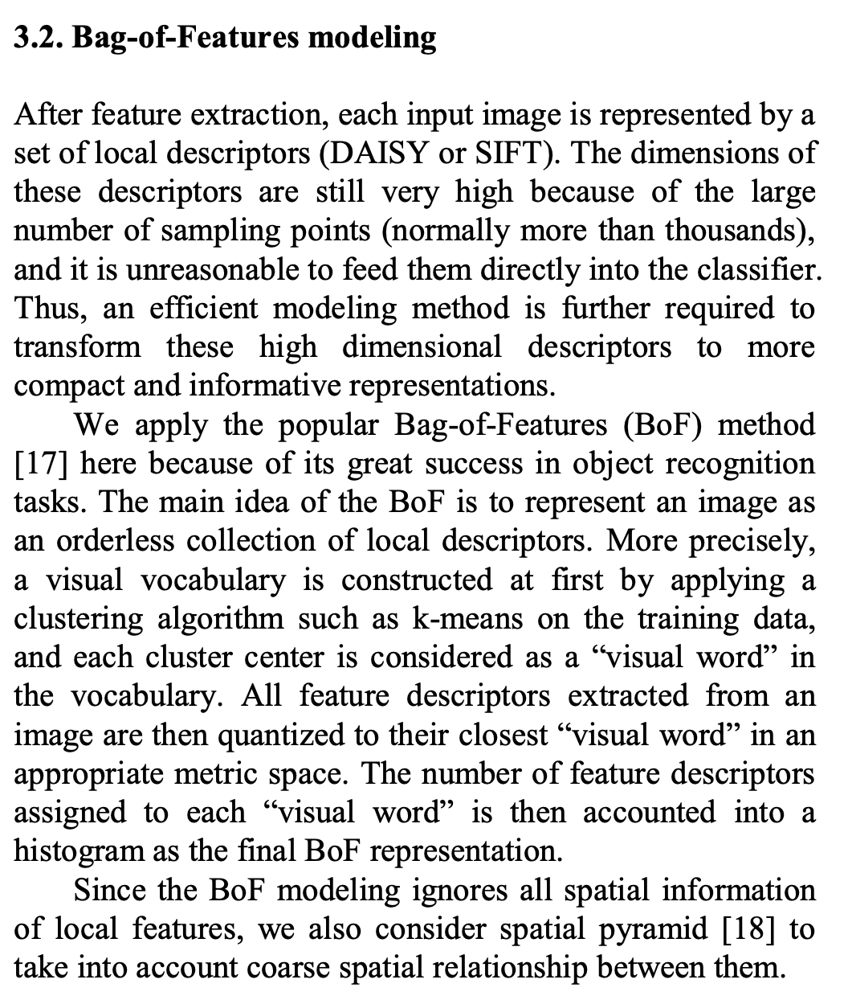

# Plan

1. ~~podejście Bag of Visual Words - jako baseline, wykorzystujące całe zrzuty ekranu. Wstępne wyniki są obiecujące.~~
2. Sprawdzić jeszcze **hdbscan**
~~3. Reprodukcja pracy Phishpedia - podejście wykorzystujące rozpoznawanie logo~~
3. Wykorzystanie modelu np. ResNet50 do obliczania embedingów a następnie wykorzystywanie bazy wektorowej do wyszukiwania podobnych obrazów a co za tym idzie atakowanego podmiotu
4. [opcjonalne] wykorzystanie całego zrzutu - uruchomienie kodu VisualPhishnet (problematyczne bo jest w Keras, z która nie mam doczynienia)
5. Zbudowanie aplikacji - przesłanie zdjęcia i otrzymanie sugerowanych celów podszycia

~~**GET SOME METRICS!!!**~~

1. na kmeansach dostać predykcje jakiekolwiek

1. ~~dbscan - doesn't work with default values~~
   1. ~~try some different values~~
1. ~~Finish 004 daisy with kmeans~~ and svm -> get raport
   1. https://projet.liris.cnrs.fr/imagine/pub/proceedings/ICME2011/HTML/Papers/MainConference/paper_708.pdf
      
1. Run phash with svm classification
1. ~~try decision tree~~ - skipped
1. run PHISHNET dataset
1. ~~color histogram - https://www.pinecone.io/learn/series/image-search/color-histograms/~~ - skipped
1. ~~bag of visual words~~
1. [optional] image net
